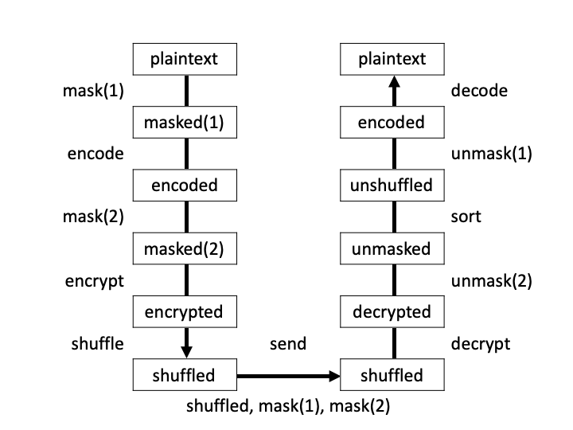

<!-- @format -->

# Cubing 暗号の利用モード

## 概要

- 平文ブロック長：45byte
- 暗号文ブロック長：54byte
- 鍵長：可変
- 暗号化処理の並列化：可 (※但し，Shuffle がボトルネックとなる)
- 復号処理の並列化：可 (※但し，Sort がボトルネックとなる)
- Random Read：不可

## 図

### 暗号化-復号の図



### 各ブロックの内容


## 流れ

### 暗号化

1. 平文をブロックに分ける
2. 必要があればパディングを用意する
3. 全ての平文に対してマスク処理を行う
4. 全てのブロックに対し，エンコードを行う
5. 全てのブロックの平文以外の箇所に対してマスク処理を行う
6. ブロックごとに暗号化を行う
7. ブロックをシャッフルする (下記「[shuffle](#shuffle)」参照)

### 復号

1. 暗号文をブロックに分ける
2. 全てのブロックに対して復号を行う
3. 暗号化の(5)で使用したマスク処理を元に戻す
4. (3)により現れるシーケンス番号を元に，ブロック間ソートを行う
5. 暗号化の(3)で使用したマスク処理を元に戻す
6. 全てのブロックに対し，デコードを行う
7. 全てのブロックを結合させ，平文を生成する

## パディング

平文ブロックが 45byte に満たない場合，1Byte 分 null 入れ，残りはランダムな英数列を入れる．

## ~~62~~ 98 進数の説明

下記#表示可能文字の文字を用いて表現できる数

## エンコード

本節では以下の記号を用いる．

$n$：現在操作しているブロックの番号(0,1,2,...)
$C_i$：ブロックの$i$ Byte 目の文字
$\mathrm{toas}(C)$：特定の文字$C$の ASCII コードにおける番号
$\mathrm{fras}(N)$：特定の数字$N$の ASCII コードにおける文字
$\mathrm{rand}()$：アルファベット又は数字から 1 文字を一様に選ぶ関数
$\mathrm{to62}(x)$：0~~~61~~ 97 までの自然数 x を~~62~~ 98 進数に従って文字に変換する関数

この時，

```math
\begin{aligned}

C_{45+i} &= \mathrm{fras}\left(\left(\left(\sum_{j=9(i-1)+1}^{9i}{\mathrm{toas}(C_j)}\right)\bmod 26\right)+97\right)\\

C_{51} &= \mathrm{to62}\left (\left \lfloor\frac{n}{~~62~~ 98}\right \rfloor \right)\\

C_{52} &= \mathrm{to62}\left ( n \bmod ~~62~~ 98 \right)\\

C_{53} &= \mathrm{rand}()\\

C_{54} &= \mathrm{rand}()\\

\end{aligned}
```

とする．ただし，$i=1,2,3,4,5$ とする．これを全てのブロックに対して行う．

## mask(1)

mask(1)では各ブロックの平文 45Byte にマスク処理を行う．まず，以下を定義する．
平文の$i$文字目：$Pi$
$i$番目のマスク：$Mi$
$\mathrm{printable\_table}$内の文字$Pi$のインデックス：$\mathrm{Idx}(Pi)$ （※$\mathrm{printable\_table}$とは，下記「[表示可能文字](#表示可能文字)」）
とすると，

```math
Pi=\mathrm{printable\_table}[(\mathrm{Idx}(Pi)+Mi) \bmod 98]\\
```

とする．

## mask(2)

mask(2)ではハッシュとシーケンス番号にマスクをかける．計算方法は上記「[mask(1)](<#mask(1)>)」と同様．

## 表示可能文字

以下の配列で定義される．

```cpp
printable_table[] = {'0', '1', '2', '3', '4', '5', '6', '7', '8', '9', 'a', 'b', 'c', 'd', 'e', 'f', 'g', 'h', 'i', 'j', 'k', 'l', 'm', 'n', 'o', 'p', 'q', 'r', 's', 't', 'u', 'v', 'w', 'x', 'y', 'z', 'A', 'B', 'C', 'D', 'E', 'F', 'G', 'H', 'I', 'J', 'K', 'L', 'M', 'N', 'O', 'P', 'Q', 'R', 'S', 'T', 'U', 'V', 'W', 'X', 'Y', 'Z', '!', '"', '#', '$', '%', '&', '\'', '(', ')', '*', '+', ',', '-', '.', '/', ':', ';', '<', '=', '>', '?', '@', '[', '\\', ']', '^', '_', '`', '{', '|', '}', '~', ' ', '\n', '\0', '\t'};
```

この順序は python の string.printable を元に作られた．
エスケープシーケンスに関しては ASCII コード参照．

## encrypt

[cubing_encrypt.md](./cubing_encrypt.md)参照．(← これないです)

## decrypt

基本的には encrypt と同じことを行うが，decrypt の場合は回転回数が変わる．
ルービックキューブは４回回転させると元に戻る性質があるため，decrypt では encrypt で $i$ 回回転させたとすると，$4-i$ 回回転させる．

## shuffle

暗号化後に全ブロックをシャッフルする．Fisher–Yates のアルゴリズムを用いることによって高速に実現可能となる．

## sort

各ブロックの 51,52 番目が昇順になるようにブロックごとにソートする．

## 送信内容

1. 暗号文
2. mask(1)
3. mask(2)

ただし，mask(2)に関してはどの mask(2)がどのブロックに適用されるのか判別するため，各ブロックの後ろに記述する．
例) [block1] [mask(2)-1] [block3] [mask(2)-3] [block2] [mask(2)-2]

## リプレイ攻撃対策

上記[shuffle](#shuffle)を行うことによって，どのブロックがもともとどこに在ったのか，という情報が隠蔽され，ブロックのすり替えができなくなる．

### ブロックが$98^2$より多くある時の処理

$62^2$個のブロックを１つの大きなブロックとして考え，各大きなブロックを ECB モードで暗号化する．
上記「[shuffle](#shuffle)」では，$98^2$個の大きなブロックごとにシャッフルする．
